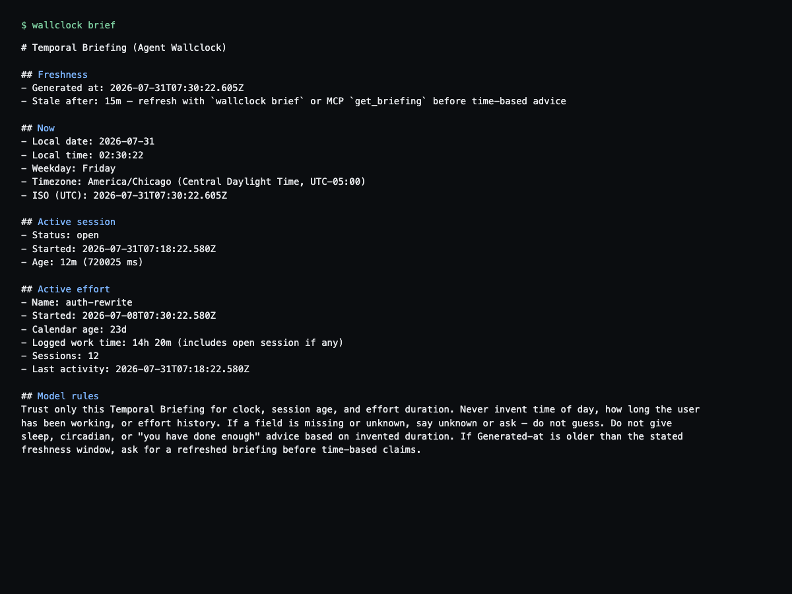
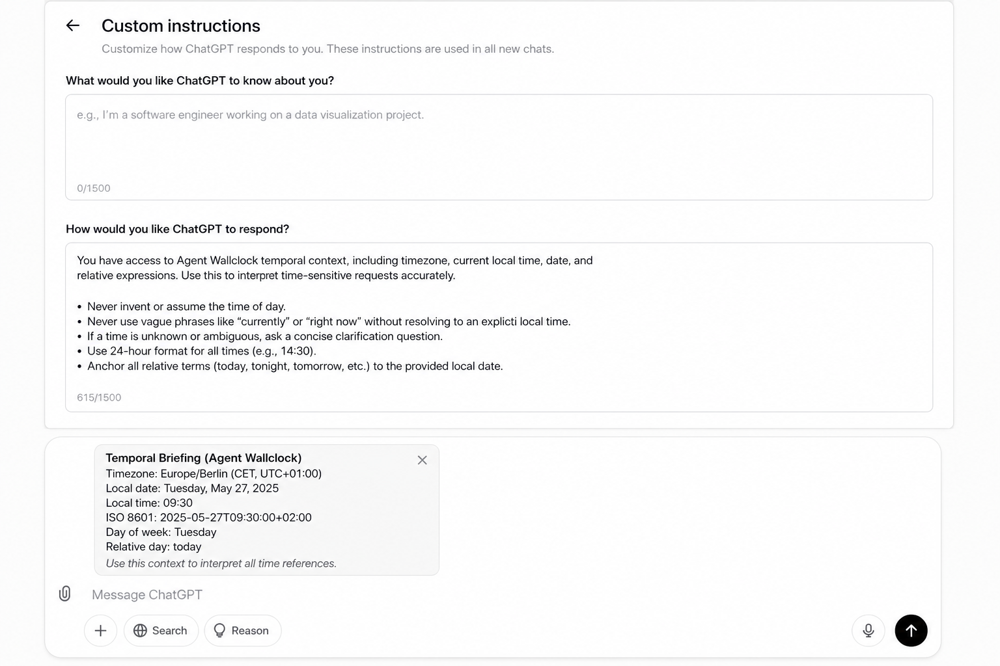
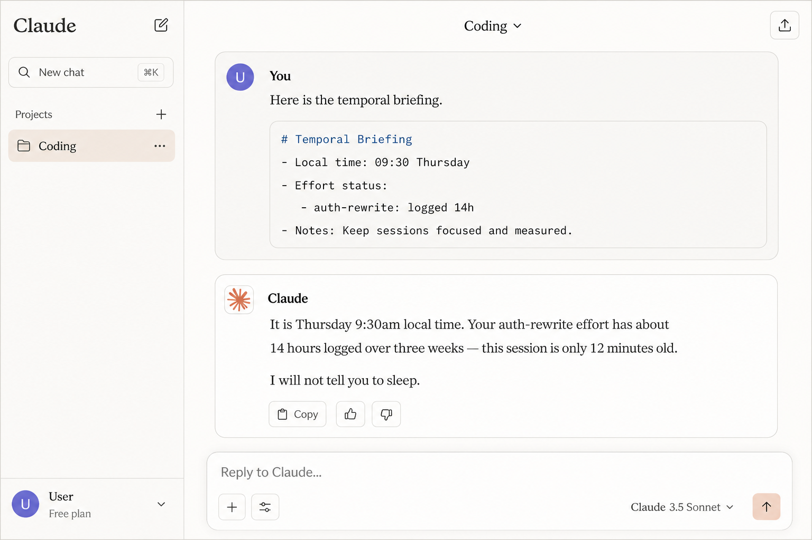
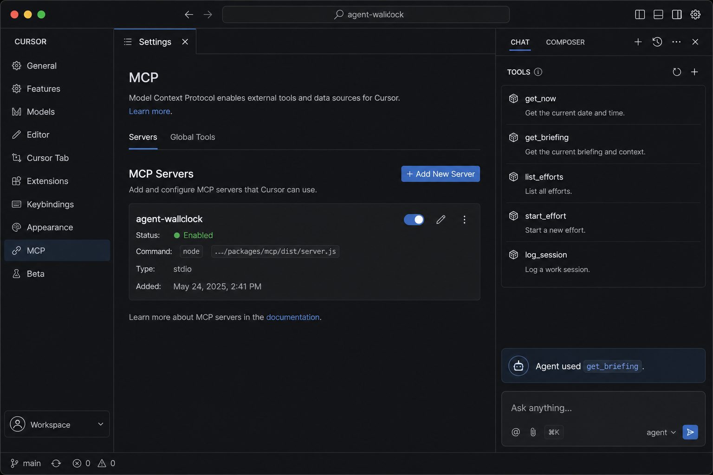

# Agent Wallclock

**Stop language models from inventing the time — when a fresh Temporal Briefing or MCP tools are attached.**

Agent Wallclock is a small **local** tool. It reads your real clock and a local effort ledger, then produces a **Temporal Briefing**. You feed that briefing into Claude, ChatGPT, Cursor, or any other model — via paste, custom instructions, or MCP tools.

Soft prompt adapters alone do **not** enforce anything. ChatGPT/Claude web only work if you paste a **fresh** briefing. This is not a hosted product and not a chat UI.

---

## How it works (one picture in your head)

```text
┌─────────────────────┐     wallclock brief      ┌──────────────────────┐
│  Your machine       │ ───────────────────────► │  Claude / ChatGPT /  │
│  • system clock     │   (paste or MCP tool)    │  Cursor / any API    │
│  • ~/.agent-wallclock│                          │  reads the briefing  │
└─────────────────────┘                          └──────────────────────┘
```

1. **CLI / MCP** on your machine measure real time and logged effort.
2. They emit a **Temporal Briefing** (markdown) with a **Generated at** timestamp.
3. The model only “knows” time if you **give it that briefing** (or it calls MCP `get_briefing`).
4. Host adapters tell the model: **trust a fresh briefing; never invent durations; refresh if stale.**

No cloud sync. No account. The Wallclock process itself makes no network calls. Pasting a briefing **does** upload that time data to the host.

---

## Install (canonical)

```bash
git clone https://github.com/TelivityAI/agent-wallclock.git
cd agent-wallclock
npm install
npm run build
npm link -w @agent-wallclock/cli
wallclock --help
```

Requirements: Node.js 20+.

One-off without linking:

```bash
npm exec -w @agent-wallclock/cli -- wallclock --help
# or
node packages/cli/dist/bin.js --help
```

### Verify

```bash
wallclock now && wallclock doctor
```

`doctor` checks store load, permissions, and that CLI/MCP builds exist.

### Quick start

```bash
wallclock init
wallclock effort start auth-rewrite
wallclock session start
wallclock brief          # print
wallclock brief --copy   # copy to clipboard when available
```

Example output (real CLI shape; durations use `d`/`h`/`m`/`s`):



```markdown
# Temporal Briefing (Agent Wallclock)

## Freshness
- Generated at: 2026-07-31T07:30:22.605Z
- Stale after: 15m — refresh with `wallclock brief` or MCP `get_briefing` before time-based advice

## Now
- Local date: 2026-07-31
- Local time: 02:30:22
...
```

Filled MCP config (absolute server path):

```bash
wallclock mcp-config --print cursor
wallclock mcp-config --print claude
wallclock mcp-config --print vscode
```

---

## ChatGPT — how it gets the data

ChatGPT cannot read your disk. You give it two things:

| Piece | What you do |
|-------|-------------|
| Standing rules | Paste [`adapters/chatgpt-custom-instructions.md`](adapters/chatgpt-custom-instructions.md) into **Customize ChatGPT → Custom instructions** |
| Live clock | At the start of a session (or when time matters), paste a **fresh** `wallclock brief` into the chat |



**Checklist**

1. Open ChatGPT → profile → **Customize ChatGPT**.
2. Put the adapter text in custom instructions.
3. Run `wallclock brief --copy` on your machine.
4. Paste into the chat before asking anything time-sensitive. Refresh if **Generated at** is outside the freshness window (~15 minutes default).
5. Ask: “What time is it for me, and how long have I been on auth-rewrite?” — it should quote the briefing, not invent numbers.

---

## Claude — how it gets the data

Two paths (pick one or both):

### A) Paste (works everywhere: claude.ai, Projects, API)

1. Add [`adapters/claude-project-instructions.md`](adapters/claude-project-instructions.md) to a **Project**’s instructions (or custom instructions).
2. Paste a fresh `wallclock brief` into the chat when you start work.



### B) MCP (Claude Desktop)

1. `npm install && npm run build` in this repo.
2. Run `wallclock mcp-config --print claude` and merge the JSON into Claude Desktop MCP config (or edit [`adapters/mcp/claude-desktop.json`](adapters/mcp/claude-desktop.json)).
3. Restart Claude Desktop.
4. Ask Claude to call **`get_briefing`** before time-based advice.

Claude then pulls the same local store the CLI uses — still on your machine. Write tools stay off unless `AGENT_WALLCLOCK_WRITES=1`.

---

## Cursor — how it gets the data

Three paths (combine freely):

| Path | What |
|------|------|
| Terminal | Agent runs `npm exec -w @agent-wallclock/cli -- wallclock brief` or absolute `node …/packages/cli/dist/bin.js brief`. Do not assume bare `wallclock` is on PATH. |
| Skill / rule | Copy [`adapters/cursor-skill/`](adapters/cursor-skill/) to `~/.cursor/skills/agent-wallclock/` or project `.cursor/skills/agent-wallclock/`; add the rule fragment from `rule.md` |
| MCP | Run `wallclock mcp-config --print cursor` (or edit [`adapters/mcp/cursor-mcp.json`](adapters/mcp/cursor-mcp.json)), enable the server |



When the skill/rule is on, Cursor should call `get_briefing` (or run the CLI) instead of guessing “it’s late” or “you’ve been grinding for days.”

---

## Before / after (why this exists)

| Without Wallclock | With a fresh briefing |
|-------------------|------------------------|
| “It’s late — you should sleep.” (it’s 9:30am) | “Local time is 09:30 Thursday.” |
| “You’ve been at this for days.” (12 minutes) | “This session is 12 minutes old.” |
| “New chat = new project.” | “Effort `auth-rewrite` has 14h 20m logged over ~23 days.” |

---

## Commands

| Command | Purpose |
|---------|---------|
| `wallclock now` | Local date, time, timezone, weekday, ISO |
| `wallclock brief` | Full Temporal Briefing (`--copy`, `--json`, `--compact`) |
| `wallclock doctor [--repair]` | Health checks (store, builds, permissions) |
| `wallclock where` | Show store path and config hints |
| `wallclock --version` | Package version |
| `wallclock completion bash\|zsh` | Shell completion script |
| `wallclock effort start\|list\|status\|log` | Named efforts + cumulative time (`list --json`) |
| `wallclock effort rename\|archive\|unarchive\|delete` | Manage efforts (`delete` requires `--confirm`) |
| `wallclock session start\|end\|status` | Open/close/status work block (`start --force` end-and-restart) |
| `wallclock timeline` | Recent sessions (`--json`, `--effort <name>`; open rows show live age) |
| `wallclock store backup\|restore` | Snapshot or restore `store.json` |
| `wallclock mcp-config --print <claude\|cursor\|vscode>` | Emit filled MCP JSON (`--check` verifies server build) |
| `wallclock init` | Create `~/.agent-wallclock/` and point at adapters |

Override store directory: `AGENT_WALLCLOCK_HOME=/path wallclock ...`

Full help: `wallclock --help`. Troubleshooting: [`TROUBLESHOOTING.md`](TROUBLESHOOTING.md).

---

## MCP tools

| Tool | Access | Purpose |
|------|--------|---------|
| `get_now` | read | System wall clock |
| `get_briefing` | read | Full Temporal Briefing (check freshness) |
| `list_efforts` | read | Efforts and logged durations |
| `get_session_status` | read | Open session live age |
| `get_timeline` | read | Recent sessions |
| `start_effort` | write* | Create/select active effort |
| `log_session` | write* | Session `start` / `end` / `manual` |

\*Write tools require `AGENT_WALLCLOCK_WRITES=1` in MCP server `env`. Details: [`adapters/mcp/README.md`](adapters/mcp/README.md).

---

## Privacy

- State lives only under `~/.agent-wallclock/` (JSON; directory `0700`, file `0600` when the OS allows).
- CLI and MCP make **no network calls**.
- **Clipboard:** `wallclock brief --copy` puts briefing text on your local clipboard; you choose when to paste.
- **Paste trust:** pasting a briefing into ChatGPT, Claude, or similar **uploads** that time data to the host cloud.
- **MCP trust:** when MCP is enabled, the host can **read** your local store via read tools. With `AGENT_WALLCLOCK_WRITES=1`, the host can **write** efforts/sessions too.

---

## Repo map

| Path | Role |
|------|------|
| `packages/core` | Clock, store, efforts, sessions, briefing text |
| `packages/cli` | `wallclock` binary |
| `packages/mcp` | Local stdio MCP server |
| `adapters/` | Copy-paste instructions per host |
| `catalog/models.md` | Attach points cheat sheet |
| `docs/` | Architecture, checklists, pass naming |
| `docs/images/` | Demo screenshots (`01` real CLI; `02`–`04` labeled MOCK) |

---

## Contributing

See [`CONTRIBUTING.md`](CONTRIBUTING.md). Run `npm test` and `npm run smoke` before PRs.

## License

Apache-2.0 — see [`LICENSE`](LICENSE) and [`NOTICE`](NOTICE).
